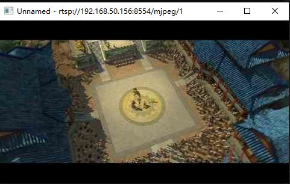

# ESP32 RTSP


This is a lightweight RTSP protocol library. It's easy to make a low-cost webcam with ESP32/ESP32-S2/ESP32-S3 chip.

## Feature

- [x] RTSP Server
- [ ] RTSP Pusher
- [x] RTSP over TCP/UDP
- [x] Supported media stream `MJPEG` `PCMA` `L16`

## Known Issues
- Video and audio cannot be synchronized
- No RTCP messages were processed
- RTSP pusher is not supported yet
- Lack of sufficient friendly API

## Resource Consumption

| ROM Size(Byte) | Static RAM Size(Byte) |
| -------------- | --------------------- |
| 10953          | 0                     |


## Run Example

 When you run the simple example,  you only need the simplest ESP32/ESP32-S2/ESP32-S3 development board.

1. entry  folder `example/simple`
2. run command `idf.py menuconfig` to configure your WiFi information
3. run command `idf.py flash monitor` to  download firmware
4. Input the RTSP url prompted in the terminal log to [VLC](https://www.videolan.org/vlc/) or ffplay

    ``` shell
    ffplay -i rtsp://192.168.50.156:8554/mjpeg/1 -rtsp_transport tcp
    ```

5. The following is the video transmitted from ESP32 through RTSP



